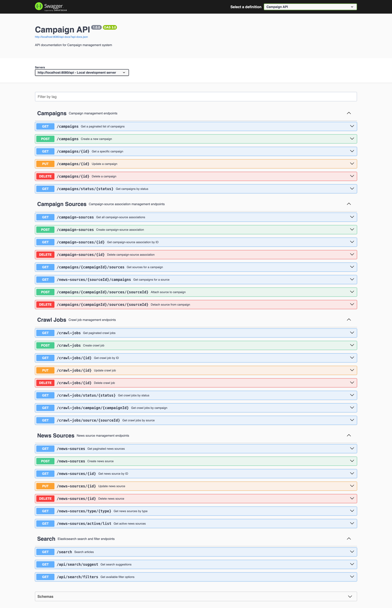

# News Crawler & Search System

A Laravel-based news aggregation system that automatically crawls news sources, extracts articles, and provides powerful search capabilities using Elasticsearch.

## Features

- 🔍 **Multi-source crawling**: Supports CNN, BBC, RSS feeds, and generic websites
- 📰 **Article extraction**: Automatically extracts headlines, content, authors, and metadata
- 🔄 **Scheduled crawling**: Automated campaigns with configurable frequencies
- 🔎 **Full-text search**: Elasticsearch-powered search with filters and suggestions
- 📊 **Queue management**: Laravel Horizon for monitoring and managing background jobs
- 🐳 **Dockerized**: Complete Docker setup with all dependencies

## Tech Stack

- **Framework**: Laravel 12
- **Database**: PostgreSQL
- **Cache/Queue**: Redis
- **Search**: Elasticsearch 8.11
- **Queue Manager**: Laravel Horizon
- **Web Server**: Nginx
- **Containerization**: Docker & Docker Compose

## Prerequisites

- Docker & Docker Compose
- 4GB+ RAM (for Elasticsearch)
- Ports available: `8080`, `5432`, `6379`, `9200`, `5050`

## Quick Start

### 1. Clone and Setup

```bash
# Run the setup script
chmod +x setup.sh
./setup.sh

make seed
```

Or manually:

```bash
# Build and start containers
docker-compose up -d --build

# Install dependencies
docker-compose exec app composer install

# Generate application key
docker-compose exec app php artisan key:generate

# Run migrations
docker-compose exec app php artisan migrate

# Seed database
docker-compose exec app php artisan db:seed
```

### 2. Access Services

- **API Docs**: http://localhost:8080/api/documentation
- **Horizon Dashboard**: http://localhost:8080/horizon
- **Backend Log viewer**: http://localhost:8080/log-viewer
- **PgAdmin**: http://localhost:5050 (admin@admin.com / admin)



### 3. View Logs

```bash
# All logs
docker-compose logs -f

# Worker logs
docker-compose logs -f worker

# App logs
tail -f storage/logs/laravel.log
tail -f storage/logs/worker.log
```


### Using Makefile

```bash
make help          # Show all available commands
make up            # Start containers
make down          # Stop containers
make logs          # View logs
make shell         # Open shell
make migrate       # Run migrations
make seed          # Seed database
```

## Configuration


### Campaign Configuration

- **Frequency**: Set `frequency_minutes` (e.g., 1440 for daily)
- **Status**: `running`, `scheduled`, `completed`, `failed`
- **Sources**: Associate campaigns with news sources via `campaign_sources` table

## Crawlers

The system supports multiple crawler types:

1. **CNN News Crawler** - Specialized for CNN articles
2. **BBC News Crawler** - Specialized for BBC articles
3. **RSS Feed Crawler** - For RSS/Atom feeds
4. **Generic Website Crawler** - Fallback for any website
5. **API Crawler** - For API-based sources

Crawlers automatically extract:
- Headline/Title
- Article content
- Author information
- Publication date
- Source URL

## Troubleshooting

### Worker not processing jobs
```bash
# Check worker logs
docker-compose logs -f worker

# Restart worker
docker-compose restart worker

# Check Horizon dashboard
# Visit http://localhost:8080/horizon
```

### Elasticsearch connection issues
```bash
# Check Elasticsearch health
curl http://localhost:9200/_cluster/health

# Check Elasticsearch logs
docker-compose logs -f elasticsearch
```


## License

MIT
